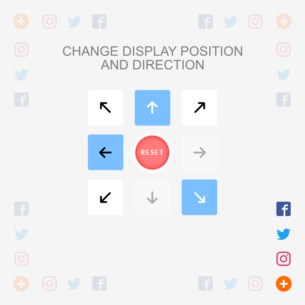

<h1 align=center>Speed dial menu</h1>

<p align="center">
  
  
  <a href="LICENSE">
    
  </a>
</p>

<p align=center>Speed dial menu, simple construction. You can set a button in every corner of the page and display smaller buttons in each direction. It is also possible to activate the 'scroll up' button</p>

<p align=center>
  
</p>

## Demo

See the demo - [example](https://tomik23.github.io/speed-dial-menu/)

> A clean css version with no dependencies is also available -> [speed-dial-css](https://github.com/tomik23/speed-dial-menu/tree/speed-dial-css)

## Installation

### CDN

#### CSS

```html
<link
  rel="stylesheet"
  href="https://cdn.jsdelivr.net/gh/tomik23/speed-dial-menu@1.1.0/dist/css/speed-dial.min.css"
/>
```

#### JavaScript

```html
<script src="https://cdn.jsdelivr.net/gh/tomik23/speed-dial-menu@1.1.0/dist/js/speed-dial.min.js"></script>
```

##### -- OR --

Download from `dist` folder and insert to html:

- dist/css/speed-dial.min.css
- dist/js/speed-dial.min.js

You can choose iife, umd and esm libraries and IE version

## Clone the repo and install dependencies

```bash
git clone
cd speed-dial-menu
```

```js
yarn
// or
npm i
```

## How to run

Dev

```js
yarn dev
// or
npm run dev
```

Prod

```js
yarn prod
// or
npm run prod
```

## Add a group of svg items

> the best place is right after opening the `<body>`

```svg
<svg xmlns="http://www.w3.org/2000/svg" style="display: none;">
  <symbol id="menu" viewBox="0 0 32 32">
    <path d="M16 0c-8.836 0-16 7.164-16 ..."></path>
  </symbol>
  <symbol id="top" viewBox="0 0 24 24">
    <path d="M7.406 15.422L6 14.016l6-6 ..."></path>
  </symbol>
  <symbol id="lightning" viewBox="0 0 32 32">
    <path d="M29 0H3C1.35 0 0 1.35 0311 ..."></path>
  </symbol>
  <symbol id="wind" viewBox="0 0 32 32">
    <path d="M32 7.075a12.941 12.941 20 ..."></path>
  </symbol>
</svg>
```

## Configuration json

```js
const speedIcons = {
  iconPlus: {
    symbol: "menu",
    color: "#1976d2", // not required
    ariaLabel: "show social buttons", // not required
  },
  iconTop: {
    symbol: "top",
    color: "red", // not required
    ariaLabel: "scroll to top", // not required
  },
  iconsSmall: [
    {
      id: 1,
      symbol: "lightning",
      url: "https://url.com", // not required
      target: "_blank", // not required
      tooltipText: "lightning", // nor required
      className: "lightning", // not required
      ariaLabel: "open lightning", // not required
    },
    {
      id: 2,
      symbol: "wind",
      className: "wind", // not required
      tooltipText: "wind", // nor required
      ariaLabel: "open wind ;)", // not required
    },
  ],
};
```

| key         | type   | require | description                                                      |
| ----------- | ------ | ------- | ---------------------------------------------------------------- |
| id          | number | ✔       | This element is used to show the order of items with icons       |
| symbol      | string | ✔       | Symbol id name from svg                                          |
| url         | string |         | The Url specifies the link's destination, not required           |
| target      | string |         | \_blank/\_self/\_parent/\_top, not required                      |
| className   | string |         | An additional class after which we can make events, not required |
| ariaLabel   | string |         | An aria-label is added to button elements                        |
| color       | string |         | Color will be used for the main button or top button             |
| tooltipText | string |         | Text that appears when you hover over the small icons            |

## Sample configuration

```js
new SpeedDial({
  icons: speedIcons,

  // delay animation time for small buttons in ms
  steps: 50,

  // show button 'scroll-top' at 100px - not required
  position: 100,

  // the option to enable the layer that covers the
  // page but is located under the speed-dial buttons
  modal: true,

  // you can hidden scroll button to to top - not required
  showTopBtn: true,

  // small icons visible after clicking on the main
  // button it doesn't hide on mouse out
  visibility: true,

  // select the page corner you want is not required
  data: {
    // bottom-right, bottom-left, top-right, top-left
    position: "bottom-right",

    // top, bottom, left, right
    direction: "top",
  },
});
```

| props          | type    | require | default        | description                                                                                                                                                                                                                 |
| -------------- | ------- | :-----: | -------------- | --------------------------------------------------------------------------------------------------------------------------------------------------------------------------------------------------------------------------- |
| icons          | object  |    ✔    |                | Icons object. Show the tooltip on the hover event                                                                                                                                                                           |
| steps          | number  |         | `50`           | Show icons with a delay animation                                                                                                                                                                                           |
| position       | number  |         | `null`         | Show button 'scroll-top-top' at 100px                                                                                                                                                                                       |
| modal          | boolean |         | `false`        | This option allows you to turn on the layer that is generated and inserted after the div with the speed-dial class. It appears when you hover over the large button. Color control and fade in and fade out possible in css |
| visibility     | boolean |         | `false`        | Smaller icons visible by default                                                                                                                                                                                            |
| showTopBtn     | boolean |         | `true`         | You can hidden scroll button                                                                                                                                                                                                |
| data/position  | string  |         | `bottom-right` | Sets the main button for us in one of the four corners [bottom-right, bottom-left, top-right, top-left]                                                                                                                     |
| data/direction | string  |         | `top`          | In which direction are the small icons to be displayed [top, bottom, left, right]                                                                                                                                           |

## Browser support

speed-dial supports all major browsers including IE 10 and above

Configuration for IE:

### local files

- dist/js/speed-dial.ie.min.js

### cdn

- https://cdn.jsdelivr.net/gh/tomik23/speed-dial-menu@1.1.0/dist/js/speed-dial.ie.min.js

## License

This project is available under the [MIT](https://opensource.org/licenses/mit-license.php) license.
